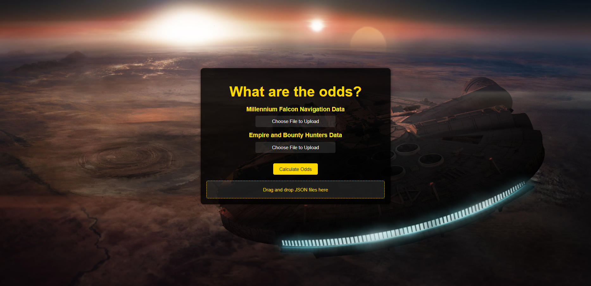
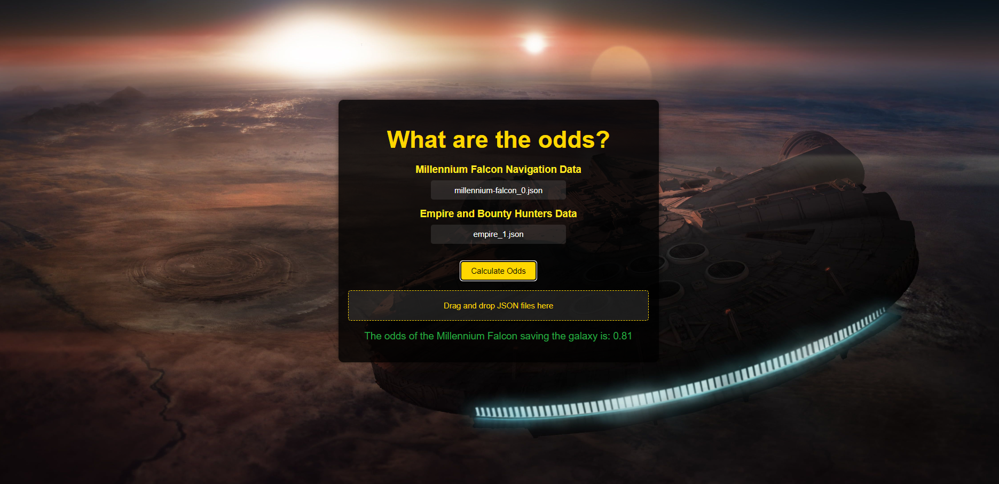
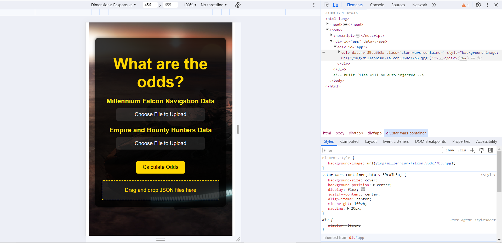

#  dataiku-technical-assessment-submission_Anthony_Bolton
Dataiku Technical Assessment: "Millennium Falcon Challenge" by Anthony Bolton

# What are the Odds?

## Introduction

This application is a tool designed to calculate the odds of the Millennium Falcon's mission success to reach Endor in time and save the galaxy. It features a Vue.js frontend for user interaction and a Flask backend for processing the calculations.

The application is designed to ensure consistent user experience on both mobile and web platforms: Below are screenshots the the applicatoon: 

*Screenshot of the web application*

*Both millennium-falcon.json and empire.json uploaded and tested for Example 2 on the original Github - returning the correct result*

*Screenshot of the mobile application*

## Backend

Built with Flask, a lightweight WSGI web application framework in Python. It is easy to use and extends into a complex application. Flask-CORS is employed for handling Cross-Origin Resource Sharing (CORS), making AJAX requests possible from the frontend to the backend.

The C3PO Class in implemented with Python, taking in JSON files as inputs from client-side Vue.js and returning the odds of success for the Millennium Falcon to save the galaxy to the frontend. 

- To navitage to the C3PO Class:
```sh
cd server/c3po/c3po.py
```

## Frontend

The frontend is crafted with Vue.js, a versatile JavaScript framework for building UIs and single-page applications. Axios is used for promise-based HTTP client to make requests to the backend.

The following features are implemented:

## Instructions

### Prerequisites

1. Before starting, ensure you have **Python** with **pip** and **Node.js** with **npm** installed on your system. 
2. It is recommended to use a **virtual environment** for the Python packages.
3. **Make sure that the local ports 8080 and 8081 are available on your system**. The Vue.js front-end application will utilize port 8080, while the Flask backend server will operate on port 8081. 

### Client-Side Setup

Install client dependencies with npm:

```sh
cd client
npm install
```
### Server-Side Setup
Set up the server dependencies using pip:
```sh
cd server
pip install -r requirements.txt
```
### Running the Application
To run the application from the client directory:
```sh
cd client
npm start
```
### Running Unit Tests on the C3PO Class from backend
Run the following command in root directory:
```sh
pytest -v --durations=0 server/tests/test_c3po.py
```

